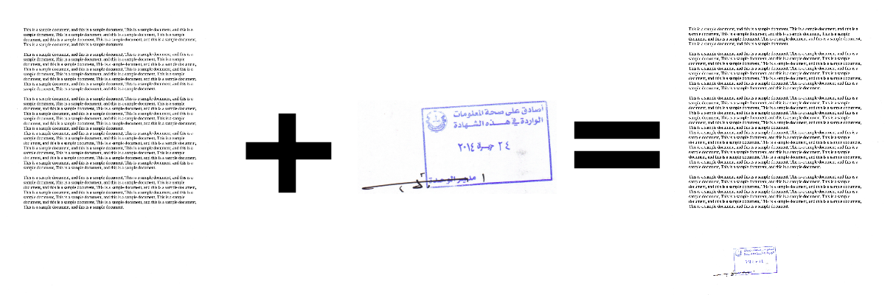
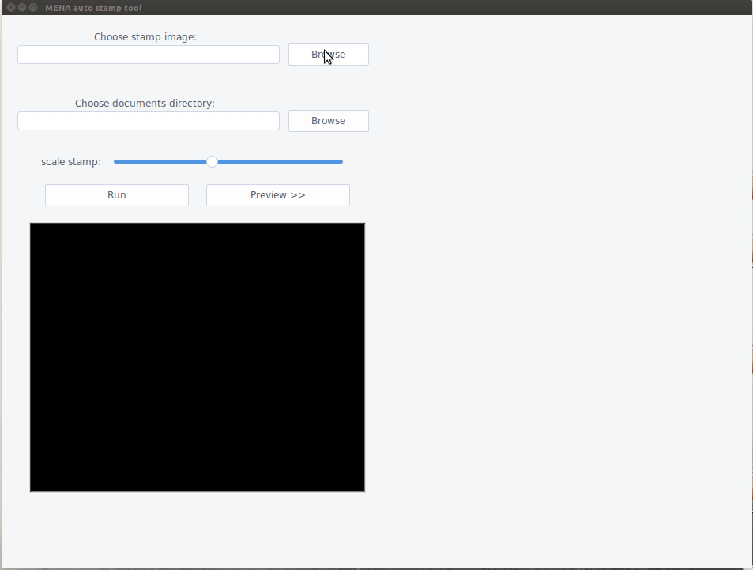

# auto_stamp
Auto Stamp is a desktop application that can be used to stamp all documents in a chosen folder, using a chosen stamp image.



### Features:

- [x] a GUI which enables user to select the stamp image, the folder which contains the documents to be stamped.
- [x] Stamp scaling.
- [x] Auto placement of stamp, it finds a suitable place to put the stamp on.
- [x] Preview panel to help user adjust the scale of the stamp.
- [x] Supported document formats: `pdf`, `bmp`, `dib`, `jpeg`, `jpg`, `jpe`, `jp2`, `png`, `webp`, `pbm`, `pgm`, `ppm`, `pxm`, `pnm`,`pfm`, `sr`, `ras`, `tiff`, `tif`, `exr`, `hdr`, `pic`.

# Installation

You can run the application from source, or download it as executable

## From source

- Install requirements:

```
pip install -r requirements.txt
```

- Run the app:

```
python gui.py 
```

## Windows

- Download the [installer](https://github.com/hasauino/auto_stamp/releases/download/v0.0.2/AutoStamp_win_installer.exe).

## Ubuntu

- Download the [executable (binary)](https://github.com/hasauino/auto_stamp/releases/download/v0.0.2/AutoStamp_ubuntu) file.

# How to use

This tool is useful when you have large number of documents you need to stamp:

- Place your documents inside a folder.
- Run the AutoStamp tool. You can scale the stamp, the preview button shows how the stamp will look like.
- Wait until all documents are stamped :smiley:

